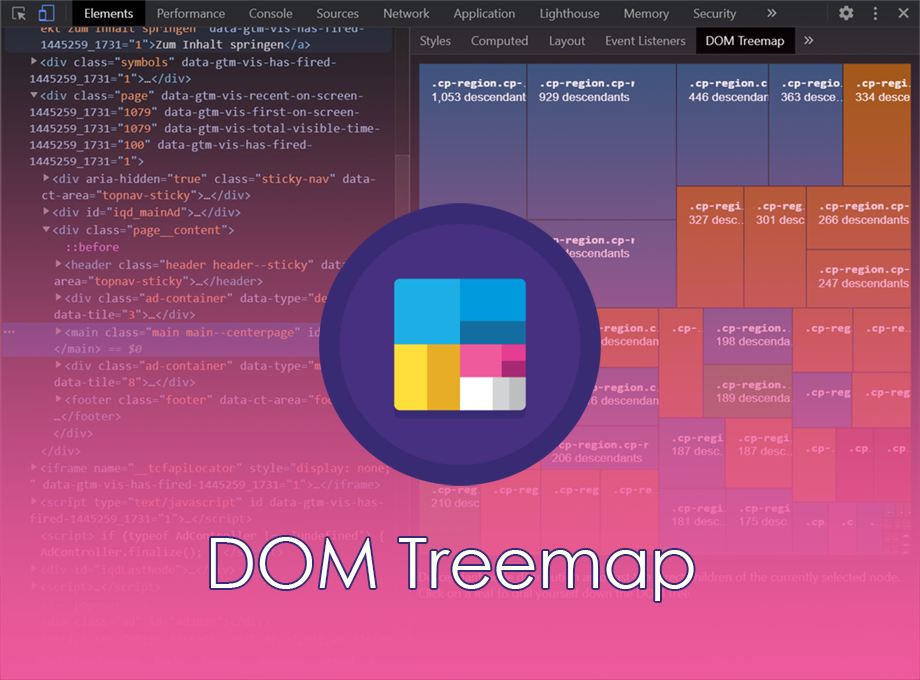
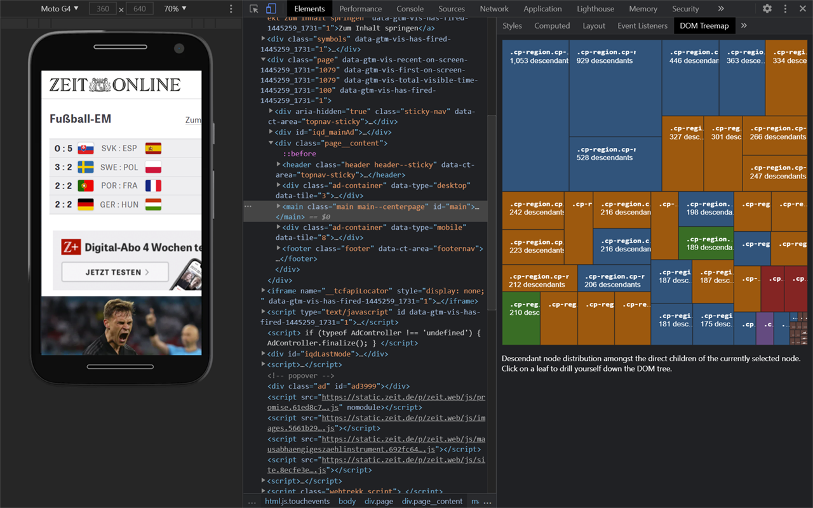
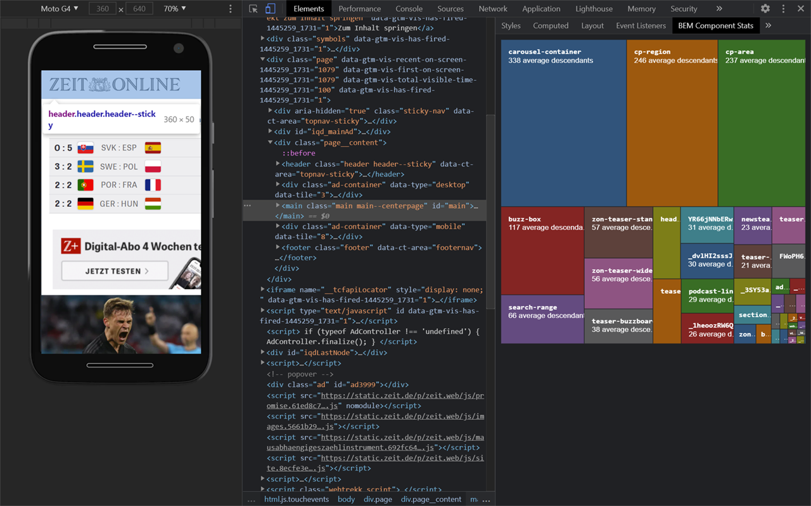

# DOM Treemap

A [Chrome](https://chrome.google.com/webstore/detail/dom-treemap/albnoggfgnooeefdjpncieecohhblonh) and [Firefox](https://addons.mozilla.org/en-US/firefox/addon/dom-treemap/) Devtools extension that helps you explore the distribution of DOM nodes in the document tree.

After a Google Lighthouse audit complaining an excessive DOM size, have you ever wondered in which corner of your document most DOM nodes are buried? Neither Lighthouse nor the Devtools themselves help finding those areas.

That's what DOM Treemap is for. It extends your Devtools Elements tab with an additional pane which visualizes the distribution of node descendants of the currently inspected DOM element. This makes it easy for you drill down your DOM and to locate all those hidden the node heavy parts.

On top of that there is an extra tab for all those BEM affiniciados which visualizes via yet another treemap how node intensive your different BEM component are in average. 

[DOM Treemap in the Chrome Web Store](https://chrome.google.com/webstore/detail/dom-treemap/albnoggfgnooeefdjpncieecohhblonh) 

[DOM Treemap in the Firefox add-ons catalogue](https://addons.mozilla.org/en-US/firefox/addon/dom-treemap/) 
